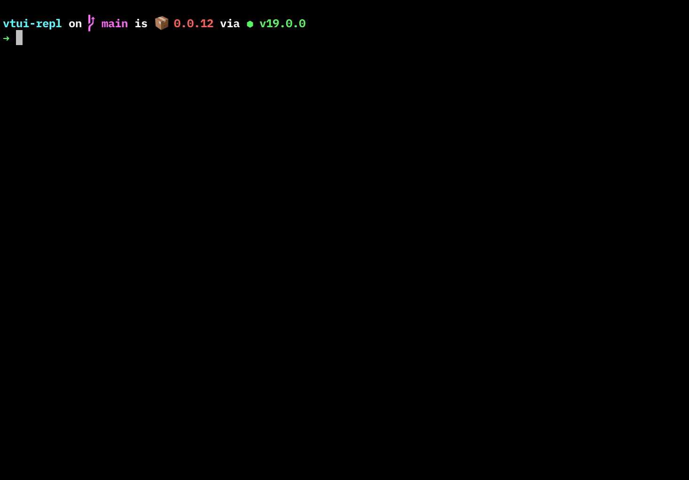

<p align="center">
  <br>
	<br>
  <a href="https://github.com/webfansplz/vtui-repl">
    
  </a>
  <br>
	<br>
</p>
<p align='center'>
Node.js REPL Terminal. Powered by <a href="https://github.com/vue-terminal/vue-termui">vue-termui</a>.
</p>


## 📺 Preview

<p align='center'>
 
</p>

## 🔥 Features

- 👼 **Out Of The Box**
- ✨ **Syntax Highlight**
- 🦾 **ESM Support**

## 📦 Install

```sh
npm -g install vtui-repl
```

## 🎮 Usage

Open the terminal and then typing `vrepl`.

```sh
vrepl
```

## 📄 License

[MIT](./LICENSE)
